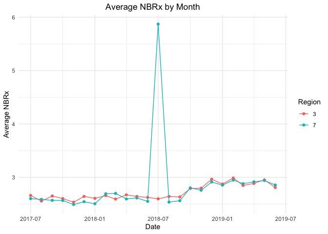
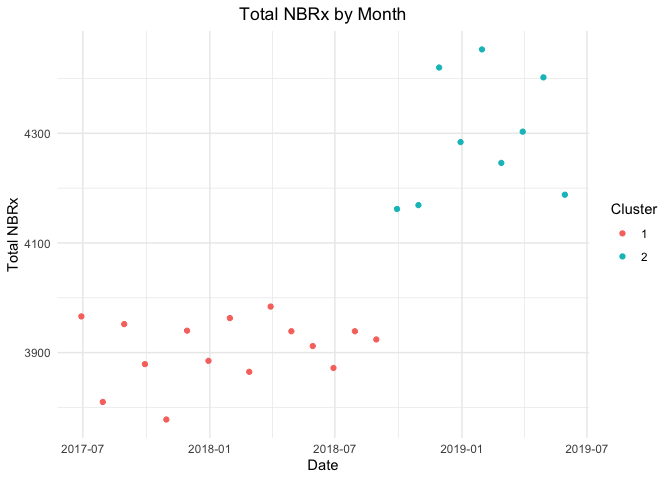

takeda_case_study
================
Roxy Zhang
1/5/2022

``` r
library(tidyverse)
```

    ## ── Attaching packages ─────────────────────────────────────── tidyverse 1.3.1 ──

    ## ✓ ggplot2 3.3.5     ✓ purrr   0.3.4
    ## ✓ tibble  3.1.6     ✓ dplyr   1.0.7
    ## ✓ tidyr   1.1.4     ✓ stringr 1.4.0
    ## ✓ readr   2.1.1     ✓ forcats 0.5.1

    ## ── Conflicts ────────────────────────────────────────── tidyverse_conflicts() ──
    ## x dplyr::filter() masks stats::filter()
    ## x dplyr::lag()    masks stats::lag()

``` r
library(readxl)
library(janitor)
```

    ## 
    ## Attaching package: 'janitor'

    ## The following objects are masked from 'package:stats':
    ## 
    ##     chisq.test, fisher.test

``` r
library(exploratory)
```

    ## Package attached: exploratory v0.3.13. Most recent version available on GitHub: v0.3.16
    ## You have an OPTION to update the package by typing 'update_exploratory()'. If you do so, make sure to restart R.

    ## 
    ## Attaching package: 'exploratory'

    ## The following object is masked from 'package:readr':
    ## 
    ##     read_csv

``` r
theme_set(theme_minimal() + theme(legend.position = "right", plot.title = element_text(hjust = 0.5)))
```

## Data cleaning

``` r
nbrx_df = read_excel("data/nbrx_data.xlsx", sheet = "raw") %>% 
  pivot_longer(
    cols = starts_with("4"),
    names_to = "date",
    values_to = "nbrx"
  ) %>% 
  janitor::clean_names() %>% 
  select(hcp_id, date, nbrx, everything()) %>% 
  mutate(
    region = as.factor(region),
    date = as.numeric(date))

# convert the numeric date to readable format
nbrx_df$date = as.Date(nbrx_df$date, origin = "1899-12-30")


call_df = read_excel("data/call_data.xlsx", sheet = "raw") %>% 
  pivot_longer(
    cols = starts_with("4"),
    names_to = "date",
    values_to = "calls"
  ) %>% 
  janitor::clean_names() %>% 
  select(hcp_id, date, calls, everything()) %>% 
  mutate(
    region = as.factor(region),
    date = as.numeric(date))

call_df$date = as.Date(call_df$date, origin = "1899-12-30")
```

## Look at the trend of nbrx form 07/01/2017 - 06/01/2019

``` r
nbrx_df %>% 
  group_by(date, region) %>% 
  summarize(sum_nbrx = sum(nbrx)) %>% 
  ggplot(aes(x = date, y = sum_nbrx, color = region)) +
  geom_point() +
  labs(
    title = "Total NBRx by Month",
    x = "Date",
    y = "Total NBRx",
    color = "Region") +
  geom_line()
```

    ## `summarise()` has grouped output by 'date'. You can override using the `.groups` argument.

<!-- -->

``` r
nbrx_df %>% 
  filter(region %in% c(3, 7)) %>% 
  group_by(date, region) %>% 
  summarize(sum_nbrx = sum(nbrx)) %>% 
  ggplot(aes(x = date, y = sum_nbrx, color = region)) +
  geom_point()+
    labs(
    title = "Total NBRx by Month",
    x = "Date",
    y = "Total NBRx",
    color = "Region") +
  geom_line()
```

    ## `summarise()` has grouped output by 'date'. You can override using the `.groups` argument.

<!-- -->

``` r
nbrx_df %>% 
  filter(region %in% c(1, 2, 4, 5, 6)) %>% 
  group_by(date, region) %>% 
  summarize(sum_nbrx = sum(nbrx)) %>% 
  ggplot(aes(x = date, y = sum_nbrx, color = region)) +
  geom_point() +
    labs(
    title = "Total NBRx by Month",
    x = "Date",
    y = "Total NBRx",
    color = "Region") +
  geom_line()
```

    ## `summarise()` has grouped output by 'date'. You can override using the `.groups` argument.

<!-- -->

## Kmeans clustering for NBRx in region 3 and 7

``` r
kmeans_df = 
  nbrx_df %>%
  mutate(date = as.numeric(date)) %>% 
  filter(region == 3) %>% 
  group_by(date) %>% 
  summarize(sum_nbrx = sum(nbrx))

kmeans_fit = 
  kmeans(x = kmeans_df, centers = 2)

kmeans_df %>% 
  broom::augment(kmeans_fit, .) %>%
  ggplot(aes(x = date, y = sum_nbrx, color = .cluster)) +
  geom_point() +
      labs(
    title = "Total NBRx by Month",
    x = "Date",
    y = "Total NBRx",
    color = "Cluster")
```

<!-- -->

## Look at the trend of sals call form 01/01/2018 - 12/01/2018

``` r
call_df %>% 
  group_by(date, region) %>% 
  summarize(sum_calls = sum(calls)) %>% 
  ggplot(aes(x = date, y = sum_calls, color = region)) +
  geom_point()+
    labs(
    title = "Total Sales Calls by Month",
    x = "Date",
    y = "Total Sales Calls",
    color = "Region") +
  geom_line()
```

    ## `summarise()` has grouped output by 'date'. You can override using the `.groups` argument.

<!-- -->

``` r
call_df %>% 
  filter(region %in% c(3, 7)) %>% 
  group_by(date, region) %>% 
  summarize(sum_calls = sum(calls)) %>% 
  ggplot(aes(x = date, y = sum_calls, color = region)) +
  geom_point()+
    labs(
    title = "Total Sales Calls by Month",
    x = "Date",
    y = "Total Sales Calls",
    color = "Region") +
  geom_line()
```

    ## `summarise()` has grouped output by 'date'. You can override using the `.groups` argument.

<!-- -->

``` r
call_df %>% 
  group_by(date, region, message_delivered) %>% 
  summarize(sum_calls = sum(calls)) %>% 
  ggplot(aes(x = date, y = sum_calls, color = region)) +
  geom_point()+
    labs(
    title = "Total Sales Calls by Month",
    x = "Date",
    y = "Total Sales Calls",
    color = "Region") +
  geom_line() +
  facet_wrap( ~ message_delivered)
```

    ## `summarise()` has grouped output by 'date', 'region'. You can override using the `.groups` argument.

<!-- -->

## Linear regression

``` r
lm_data = left_join(nbrx_df, call_df, by = c("hcp_id", "date")) %>% 
  select(-ends_with(".y"))
#%>% 
 # rename
```
