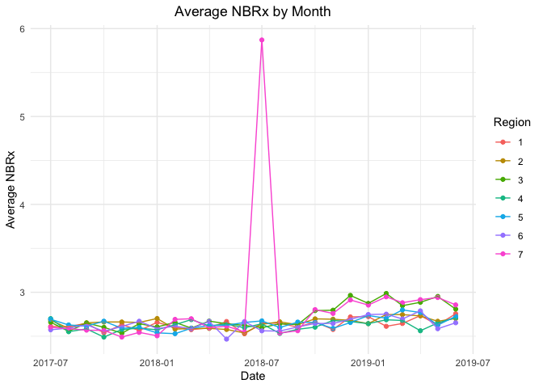

takeda_case_study
================
Roxy Zhang
1/5/2022

``` r
library(tidyverse)
```

    ## ── Attaching packages ─────────────────────────────────────── tidyverse 1.3.1 ──

    ## ✓ ggplot2 3.3.5     ✓ purrr   0.3.4
    ## ✓ tibble  3.1.6     ✓ dplyr   1.0.7
    ## ✓ tidyr   1.1.4     ✓ stringr 1.4.0
    ## ✓ readr   2.1.1     ✓ forcats 0.5.1

    ## ── Conflicts ────────────────────────────────────────── tidyverse_conflicts() ──
    ## x dplyr::filter() masks stats::filter()
    ## x dplyr::lag()    masks stats::lag()

``` r
library(readxl)
library(janitor)
```

    ## 
    ## Attaching package: 'janitor'

    ## The following objects are masked from 'package:stats':
    ## 
    ##     chisq.test, fisher.test

``` r
library(exploratory)
```

    ## Package attached: exploratory v0.3.13. Most recent version available on GitHub: v0.3.16
    ## You have an OPTION to update the package by typing 'update_exploratory()'. If you do so, make sure to restart R.

    ## 
    ## Attaching package: 'exploratory'

    ## The following object is masked from 'package:readr':
    ## 
    ##     read_csv

``` r
theme_set(theme_minimal() + theme(legend.position = "right", plot.title = element_text(hjust = 0.5)))
```

## Data cleaning

``` r
nbrx_df = read_excel("data/nbrx_data.xlsx", sheet = "raw") %>% 
  pivot_longer(
    cols = starts_with("4"),
    names_to = "date",
    values_to = "nbrx"
  ) %>% 
  janitor::clean_names() %>% 
  select(hcp_id, date, nbrx, everything()) %>% 
  mutate(
    region = as.factor(region),
    date = as.numeric(date))

# convert the numeric date to readable format
nbrx_df$date = as.Date(nbrx_df$date, origin = "1899-12-30")


call_df = read_excel("data/call_data.xlsx", sheet = "raw") %>% 
  pivot_longer(
    cols = starts_with("4"),
    names_to = "date",
    values_to = "calls"
  ) %>% 
  janitor::clean_names() %>% 
  select(hcp_id, date, calls, everything()) %>% 
  mutate(
    region = as.factor(region),
    date = as.numeric(date))

call_df$date = as.Date(call_df$date, origin = "1899-12-30")
```

## Look at the trend of nbrx form 07/01/2017 - 06/01/2019

``` r
nbrx_df %>% 
  filter(region %in% c(3, 7)) %>% 
  group_by(date, region) %>% 
  summarize(mean_nbrx = mean(nbrx)) %>% 
  ggplot(aes(x = date, y = mean_nbrx, color = region)) +
  geom_point()+
    labs(
    title = "Average NBRx by Month",
    x = "Date",
    y = "Average NBRx",
    color = "Region") +
  geom_line()
```

    ## `summarise()` has grouped output by 'date'. You can override using the `.groups` argument.

<!-- -->

``` r
nbrx_df %>% 
  group_by(date, region) %>% 
  summarize(mean_nbrx = mean(nbrx)) %>% 
  ggplot(aes(x = date, y = mean_nbrx, color = region)) +
  geom_point()+
    labs(
    title = "Average NBRx by Month",
    x = "Date",
    y = "Average NBRx",
    color = "Region") +
  geom_line()
```

    ## `summarise()` has grouped output by 'date'. You can override using the `.groups` argument.

<!-- -->

# filter out segmented from pilot regions

``` r
nbrx_df %>% 
  filter(region %in% c(3, 7)) %>% 
  group_by(date, region, message_delivered) %>% 
  summarize(mean_nbrx = mean(nbrx)) %>% 
  ggplot(aes(x = date, y = mean_nbrx, color = region)) +
  geom_point()+
    labs(
    title = "Average NBRx by Month",
    x = "Date",
    y = "Average NBRx",
    color = "Region") +
  geom_line() +
  facet_wrap( ~ message_delivered) +
  theme(panel.spacing = unit(2, "lines"))
```

    ## `summarise()` has grouped output by 'date', 'region'. You can override using the `.groups` argument.

<!-- -->

## Kmeans clustering for NBRx in region 3 and 7

``` r
# there is a outlier in region 7, so only conduct kmeans on region 3
kmeans_df = 
  nbrx_df %>%
  mutate(date = as.numeric(date)) %>% 
  filter(region == 3) %>% 
  group_by(date) %>% 
  summarize(sum_nbrx = sum(nbrx))

kmeans_fit = 
  kmeans(x = kmeans_df, centers = 2)

kmeans_df %>% 
  mutate(date = as.Date(date, origin = "1969-12-30")) %>% 
  broom::augment(kmeans_fit, .) %>%
  ggplot(aes(x = date, y = sum_nbrx, color = .cluster)) +
  geom_point() +
      labs(
    title = "Total NBRx by Month",
    x = "Date",
    y = "Total NBRx",
    color = "Cluster")
```

<!-- -->

## Look at the trend of sals call form 01/01/2018 - 12/01/2018

``` r
call_df %>% 
  group_by(date, region) %>% 
  summarize(sum_calls = sum(calls)) %>% 
  ggplot(aes(x = date, y = sum_calls, color = region)) +
  geom_point()+
    labs(
    title = "Total Sales Calls by Month",
    x = "Date",
    y = "Total Sales Calls",
    color = "Region") +
  geom_line()
```

    ## `summarise()` has grouped output by 'date'. You can override using the `.groups` argument.

<!-- -->

``` r
call_df %>% 
  filter(region %in% c(3, 7)) %>% 
  group_by(date, region) %>% 
  summarize(sum_calls = sum(calls)) %>% 
  ggplot(aes(x = date, y = sum_calls, color = region)) +
  geom_point()+
    labs(
    title = "Total Sales Calls by Month",
    x = "Date",
    y = "Total Sales Calls",
    color = "Region") +
  geom_line()
```

    ## `summarise()` has grouped output by 'date'. You can override using the `.groups` argument.

<!-- -->

``` r
call_df %>% 
  group_by(date, region, message_delivered) %>% 
  summarize(sum_calls = sum(calls)) %>% 
  ggplot(aes(x = date, y = sum_calls, color = region)) +
  geom_point()+
    labs(
    title = "Total Sales Calls by Month",
    x = "Date",
    y = "Total Sales Calls",
    color = "Region") +
  geom_line() +
  facet_wrap( ~ message_delivered)
```

    ## `summarise()` has grouped output by 'date', 'region'. You can override using the `.groups` argument.

<!-- -->

## Linear regression

``` r
lm_data = left_join(nbrx_df, call_df, by = c("hcp_id", "date")) %>% 
  select(-ends_with(".y")) %>% 
  rename(
    region = region.x,
    segment = segment.x,
    message_delivered = message_delivered.x) %>% 
  select(hcp_id, date, nbrx, calls, everything()) %>% 
  drop_na() %>% 
  filter(message_delivered == "Segmented")
```

``` r
fit = lm(nbrx ~ calls, data = lm_data)

broom::tidy(fit)
```

    ## # A tibble: 2 × 5
    ##   term        estimate std.error statistic  p.value
    ##   <chr>          <dbl>     <dbl>     <dbl>    <dbl>
    ## 1 (Intercept)  3.08        0.794    3.88   0.000106
    ## 2 calls        0.00637     0.340    0.0187 0.985

``` r
broom::glance(fit)
```

    ## # A tibble: 1 × 12
    ##      r.squared adj.r.squared sigma statistic p.value    df  logLik    AIC    BIC
    ##          <dbl>         <dbl> <dbl>     <dbl>   <dbl> <dbl>   <dbl>  <dbl>  <dbl>
    ## 1 0.0000000302    -0.0000861  46.4  0.000351   0.985     1 -61057. 1.22e5 1.22e5
    ## # … with 3 more variables: deviance <dbl>, df.residual <int>, nobs <int>

``` r
plot(fit)
```

<!-- --><!-- --><!-- --><!-- -->

## Hypothesis test

``` r
# patient advocate: segmented vs standard across all regions
pa_segmented = 
  nbrx_df %>% 
  mutate(date = as.numeric(date)) %>% 
  filter(
    date >= 17713, # filter data after 2018-07-01
    date <= 17866, # filter data before 2018-12-01
    segment == "Patient Advocate",
    message_delivered == "Segmented" ) %>% 
  select(nbrx)

pa_standard = 
  nbrx_df %>% 
  mutate(date = as.numeric(date)) %>% 
  filter(
    date >= 17713,
    date <= 17866,
    segment == "Patient Advocate",
    message_delivered == "Standard" ) %>% 
  select(nbrx)

t.test(pa_segmented, pa_standard) # not significant
```

    ## 
    ##  Welch Two Sample t-test
    ## 
    ## data:  pa_segmented and pa_standard
    ## t = 1.2629, df = 5810.5, p-value = 0.2067
    ## alternative hypothesis: true difference in means is not equal to 0
    ## 95 percent confidence interval:
    ##  -0.6004528  2.7749103
    ## sample estimates:
    ## mean of x mean of y 
    ##  3.664773  2.577544

``` r
qt(0.975, 5810.5)
```

    ## [1] 1.960372

``` r
# segmented vs standard in pilot regions
pilot_segmented = 
  nbrx_df %>% 
  mutate(date = as.numeric(date)) %>% 
  filter(
    date >= 17713, # filter data after 2018-07-01
    date <= 17866, # filter data before 2018-12-01
    region %in% c(3, 7),
    message_delivered == "Segmented" ) %>% 
  select(nbrx)

pilot_standard = 
  nbrx_df %>% 
  mutate(date = as.numeric(date)) %>% 
  filter(
    date >= 17713,
    date <= 17866,
    region %in% c(3, 7),
    message_delivered == "Standard" ) %>% 
  select(nbrx)

t.test(pilot_segmented, pilot_standard) # not significant
```

    ## 
    ##  Welch Two Sample t-test
    ## 
    ## data:  pilot_segmented and pilot_standard
    ## t = 1.1597, df = 5812.8, p-value = 0.2462
    ## alternative hypothesis: true difference in means is not equal to 0
    ## 95 percent confidence interval:
    ##  -0.6893328  2.6863692
    ## sample estimates:
    ## mean of x mean of y 
    ##  3.664773  2.666255

``` r
qt(0.975, 5812)
```

    ## [1] 1.960372

``` r
# sales calls
pa_segmented_calls = 
  call_df %>% 
  filter(
    date >= 17713,
    date <= 17866,
    segment == "Patient Advocate",
    message_delivered == "Segmented" ) %>% 
  select(calls)

pa_standard_calls = 
  call_df %>% 
  filter(
    date >= 17713,
    date <= 17866,
    segment == "Patient Advocate",
    message_delivered == "Standard" ) %>% 
  select(calls)

t.test(pa_segmented_calls, pa_standard_calls) # significant
```

    ## 
    ##  Welch Two Sample t-test
    ## 
    ## data:  pa_segmented_calls and pa_standard_calls
    ## t = 13.43, df = 11361, p-value < 2.2e-16
    ## alternative hypothesis: true difference in means is not equal to 0
    ## 95 percent confidence interval:
    ##  0.2187124 0.2934693
    ## sample estimates:
    ## mean of x mean of y 
    ##  2.163395  1.907304

``` r
qt(0.975, 11361)
```

    ## [1] 1.960173

# Look at distribution of nbrx - boxplot

``` r
nbrx_df %>% 
  mutate(date = as.numeric(date)) %>% 
  filter(
    nbrx != 5000,
    date >= 17713, # filter data after 2018-07-01
    date <= 17866) %>%  # filter data before 2018-12-01
  ggplot(aes(y = nbrx)) +
  geom_boxplot(aes(group = segment, fill = segment), alpha = .5) +
  facet_grid(segment ~ message_delivered) +
  labs(
    title = "Distribution of NBRx",
    y = "NBRx"
  ) +
  theme(
    axis.text.x = element_blank(),
    axis.ticks.x = element_blank())
```

<!-- -->
